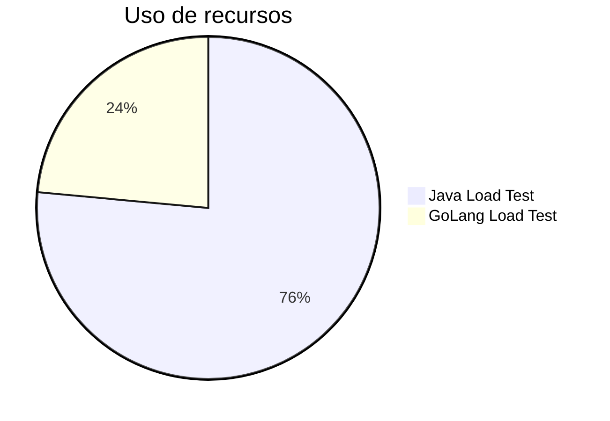
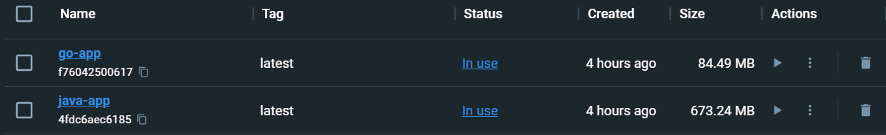

# Teste de carga Java x Golang

## Objetivo

O objetivo deste teste é comparar o desempenho de uma aplicação escrita em Java e outra escrita em GoLang.

Lembrando que o objetivo não é comparar as linguagens, mas sim o desempenho das aplicações.

Para isolamento do teste, foi criado um container para cada aplicação, assim o teste é executado num ambiente controlado.

## Aplicação

A aplicação é bem simples, ela consiste dois endpoints que mostra o número de iteracoes de um ‘loop’.

O intuito é testar o desempenho de uma aplicação que faz um processamento mais pesado.

Numa thred na aplicação é executado um ‘buffer’ em memória de 1MB, este vai a incrementar em etapas 1MB ate chegar a 1GB logo é esvaceado para 1MB e assim sucessivamente, com isso é possivel ver o consumo de memória da aplicação e o uso de CPU.

## Resultados

| Aplicação | Tempo de início | Tempo de término | Tempo de execução | Memoria inicio| Memoria termino | Memória utilizada | CPU inicio | CPU termino | CPU utilizada |
|-----------|-----------------|------------------|-----------|---------------|-----------------|-------------------|------------|-------------|---------------|
| Java      | 18:31:00        | 18:44:00         | 13 minutos | 3.75 GB       | 4.3 GB          | 4.3 GB            | 98%       | 102%        | 102%          |
| GoLang    | 18:54:00        | 18:58:00         | 4 minutos  | 3.52 GB       | 3.76 GB         | 3.76 GB           | 9.90%     | 19.20%      | 19.20%        |

## Comparação de desempenho

## Conclusão

A aplicação escrita em GoLang teve um desempenho muito superior à aplicação escrita em Java, tanto em tempo de execução quanto em consumo de memória e CPU.

Lembre-se que o objetivo não é comparar as linguagens, mas sim o desempenho das aplicações.

###### Observação:

Cenarios diferentes podem ter resultados diferentes, isso inclui posibilidade de resultados opostos.

## Como executar

Todo o codigo fonte está disponivel no repositorio.

## Imagens de análise de desempenho

### Tamanho das imagens

Se nota que a imagem do Java é bem maior que a do GoLang, isso se deve ao fato de que a imagem do Java contem o JRE e a do GoLang não.

### Java

### GoLang

## Resumo a nivel de codigo, do que esta dentro de cada projeto

### Java

| Language | Files | Lines | Code | Comments | Blanks |
|----------|-------|-------|------|----------|--------|
| Batch     | 1     | 205     | 169      | 0        | 36     |
| Dockerfile| 1     | 22      | 8        | 6        | 8      |
| Java      | 4     | 83      | 64       | 1        | 18     |
| Shell     | 1     | 308     | 214      | 64       | 30     |
| Plain Text| 2     | 4       | 0        | 4        | 0      |
| XML       | 2     | 123     | 119      | 0        | 4      |
| Total     | 11    | 745     | 574      | 75       | 96    |

### GoLang

| Language | Files | Lines | Code | Comments | Blanks |
|----------|-------|-------|------|----------|--------|
| Dockerfile| 1     | 19      | 9        | 2        | 8      |
| Go       | 1     | 77      | 65       | 0        | 12     |
| Total    | 3     | 96      | 74       | 2        | 20     |
